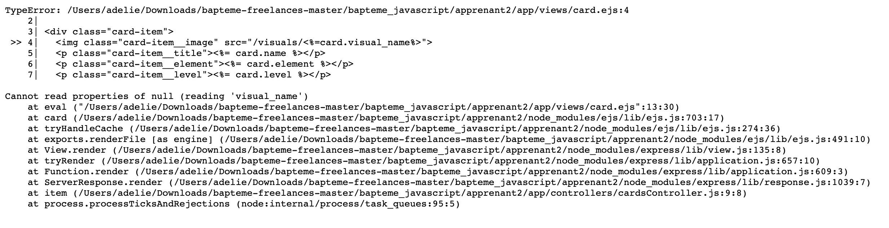

## Apprenant 2

<br>

> Quelques initiatives intéressantes! C'est top d'essayer de faire différemment, c'est comme ça qu'on apprend. Par contre, c'est bien aussi de suivre les consignes d'abord 😉 c'est aussi comme ça qu'on se force à apprendre des trucs utiles

<br/>

-   [Étape 1](#étape-1---détail-dune-carte)
-   [Étape 2](#étape-2---recherche)
-   [Étape 3](#étape-3---construire-un-deck)

<br />

### Étape 1 - Détail d'une carte

#### **_dataMapper > getOneCard_**

Bonne initiative d'avoir vérifié le résultat de ta requête et renvoyé une réponse dans tous les cas 👌

#### **_cardsController > item_**

Ici, c'est une bonne idée de t'assurer que tu envoies bien un nombre à ta db! `parseInt` est une solution plus fiable que `Number()` pour ça cela dit. Elle ne change pas le type de ce que tu lui passes, donc si ce n'est pas ou si ça ne contien pas un nombre, elle renverra `NaN` dans tous les cas : on peut mieux gérer les anormalités, c'est plus prévisible. Petite explication [ici](https://thisthat.dev/number-constructor-vs-parse-int/) si tu veux creuser.

Ta méthode est presque parfaite, il manque juste un détail : il se passe quoi, à ton avis, si je passe un id qui n'existe pas ou un texte en guise d'id?

<details>
<summary>il se passe ça 😅 </summary>



</details>
<br/>
Tu as 2 solutions :

-   soit tu vérifies dans ta view que card existe avant d'aller chercher des choses dedans
-   soit tu vérifies que card existe dans ton controller avant de render ta view et tu renvoies vers une 404

-> on est d'accord pour dire que c'est mieux de dire à l'utilisateur que ce qu'il demande n'existe pas?

donc la solution de la correction :

```js
if (card) {
	res.render("card", { card });
} else {
	res.status(404).send(`Card with id ${id} not found`);
}
```

Et là, soit tu créés une view pour ton erreur 404, soit tu laisses le handler par défaut l'afficher pour toi 😉

#### **_views > card_**

Ta view est bien, elle pourrait être mieux si on chipote (et je ne parle pas de l'affichage, ici on s'en fiche), mais je soupçonne que tu saches déjà comment améliorer sa structure 😉 Par exemple :

-   un h1
-   un alt sur ton image
-   des indications de ce que tu affiches
-   les informations que tu pourrais afficher en plus

### Étape 2 - Recherche

#### **_Par élément_**

Alors... c'est bien de prendre des initiatives 👍 MAIS...

1. c'est toujours mieux de faire faire un boulot de tri à sql qu'à javascript quand on peut, et de récupérer juste les données dont on a besoin en mémoire. Sql va plus vite, c'est sa spécialité! En plus, là tu ne t'épargnes même pas une requête puisque tu vas chercher quand même les cartes en db.
2. ta solution marche pour ceux qui ont un élément, mais les autres 😉 ?
3. j'ai dû aller voir ta fonction `getElements` pour savoir ce qu'elle était censée aller chercher -> ça m'a mis le doute... `getCardsWithElements` serait plus approprié 😉 Alors je sais, ici on s'en fiche un peu parce que toi tu te comprends, mais si tu travaillais en équipe, tu entendrais des gens râler...
4. tu n'es pas certain d'avoir récupéré quoi que ce soit avant d'essayer de filtrer ton résultat, et tu ne `catch` pas l'erreur que ça provoquerait si `results` était null ou undefined. Suffit d'un problème en db et ton app crash là 🙉

Du coup, je te propose les améliorations suivantes si tu tiens à faire faire le sale boulot à JS :

```js
//controllers/searchController.js
...
getSearchResults : async (req, res) => {
    try {
        const cardElement = req.query.element;

        //tu récupères TOUTES les cartes
        const cards = await dataMapper.getAllCards();

        //tu lances une erreur si tu n'as pas de cartes : c'est pas normal
        if (!cards?.length)
            throw new Error(
                "Uh oh, could not get any cards back from db..."
            );

        //tu renvoies toutes les cartes si un petit malin a lancé une recherche sans donner de valeur à element
        if (!cardElement) res.render("searchResults", { results: cards });

        const results = cards.filter((card) => {
            if (cardElement === "null") {
                 //si cardElement est la string 'null', tu renvoies uniquement les cartes qui n'ont pas d'élément
                return !card?.element;
            } else {
                //sinon, D'ABORD tu check que la carte ait bien un élément, ensuite tu le compares à cardElement
                return card?.element && card.element.includes(cardElement);
            }
        });
        res.render("searchResults", { results });
    } catch (error) {
        res.status(500).send(
            error?.message ||
                "Something went wrong while searching by elements..."
        );
    }
  }
...
```

Mais pour revenir à ce que je disais plus haut, il vaut mieux laisser les boulots de tri et de recherche à l'expert dans le domaine : SQL. Je te conseille donc d'adopter la solution de la correction pour de meilleures perf' 😉

Je vois que tu n'as pas implémenté les autres méthodes de recherche. Tu as bien compris la correction? Sinon, n'hésite pas à me contacter pour que je te l'explique!

### Étape 3 - Construire un deck

#### **_Activer les sessions_**

Je vois que tu as activé ta session dans index.js 👌
Je vois aussi que tu as laissé ton chat écrire le `secret` 😼 ... La prochaine fois, tu pourras expliquer à ton chat que la bonne pratique quand on a une constante importante comme ça, c'est de la stocker en variable d'environnement 😉

```js
//.env
SESSION_SECRET = "dadp kdfpkazdf kaf   a*fka kfafâlfaflafelfafv lefa";
```

```js
//index.js
...
app.use(sessionMiddleware({
  secret: process.env.SESSION_SECRET,
  resave: false,
  saveUninitialized: true,
  cookie: { secure: false }
}));
...
```

#### **_Ajouter une carte au deck_**

C'est cool, tu vérifies que le deck est en session et l'initialises avant d'essayer d'ajouter une carte 👌
Ce serait mieux que ce ne soit pas le boulot de ton controller cela dit. Tu as du voir dans la correction que c'est fait dans index.js, avant même que le router soit initialisé, comme ça aucun risque, et plus besoin d'y penser après!

```js
//index.js de la correction
...
//middleware maison pour initialiser le deck
app.use((request, response, next) => {
	//si la propriété deck de la session vaut undefined, on la crée
	if (!request.session.deck) {
		request.session.deck = []
	}
	//sinon, on fait rien ...
	//et on passe la main au middleware suivant
	next();
});
...
```

Je te félicite d'avoir vérifié que la carte qu'on essaie d'ajouter existe bien 👌
Pour l'ajout d'une carte, c'est tout bon! Par contre la consigne c'était d'empêcher d'en avoir plus de 5 dans le deck 😉 Il te manque une seconde vérif' :

```js
if (!foundDeckCard && req.session.deck.length < 5) {
	req.session.deck.push(deckCard);
}
```

#### **_Page pour visualiser le deck_**

Le controller est nickel. La view a un tout petit souci : je crois que tu as voulu faire un panier 😅 ? Il n'y a pas de price dans les cards. Tu as un $ innutile qui se balade tranquillement tout seul.
Tu as aussi mis 'Élément' dans le header de ton tableau mais pas dans tes lignes 😉

Je te félicite de vérifier dans ta view que le deck existe bien. Comme tu ne l'initialises qu'au moment d'ajouter une première carte, c'est bien vu!
