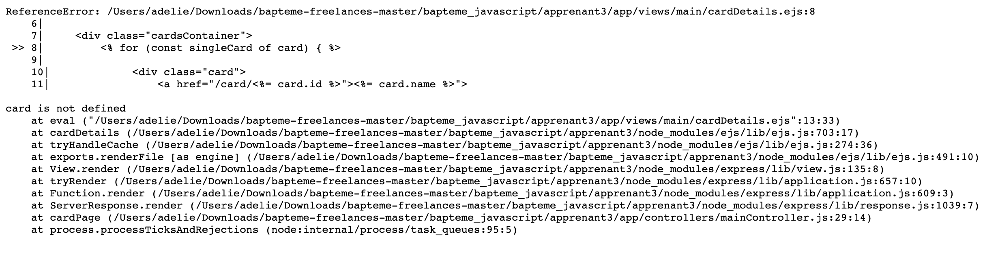

## Apprenant 3

<br>

> Tu as essayé chaque étape et pour ça je te félicite! N'hésite pas à appeler à l'aide lorsque tu ne comprends pas soit une consigne, soit la correction. C'est très important de savoir demander de l'aide pour progresser, surtout au début!

<br/>

-   [Étape 1](#étape-1---détail-dune-carte)
-   [Étape 2](#étape-2---recherche)
-   [Étape 3](#étape-3---construire-un-deck)

<br />

### Étape 1 - Détail d'une carte

#### **_dataMapper > getCard_**

Rien à dire, cette méthode est par-faite 👏

#### **_mainController > cardPage_**

Je te félicite d'avoir géré le cas où on demande une carte qui n'existe pas avec `next()`. Le mieux, c'est tout de même de lui passer une erreur 404 pour être certain que c'est le handler d'erreur d'express qui va récupérer la requête.

#### **_views > card_**

Mmh... J'imagine que tu n'as pas testé, ou que tu as changé des trucs à la dernière minute.

<details>
<summary>Une jolie erreur apparaît quand on clique sur une carte</summary>



</details>
-> tu passes une variable qui s'appelle ``oneCard``` dans ton controller, et tu tentes de récupérer ```card``` dans ta view. ET tu boucle sur ```card``` comme si c'était un tableau ? Si tu regardes bien ta méthode dans dataMapper, elle ne peut être qu'une card ou ```null```.

Du coup pour afficher ta carte dans cardDetails :

```html
<%- include('../partials/header'); %>
<!-- J'ai changé card en oneCard partout où tu l'appelais -
    ç'aurait probablement été plus simple de remplacer oneCard par card dans ton controller ;-) -->

    <h1>
        Détails de carte
    </h1>

    <div class="cardsContainer">
        <!--  j'ai retiré la boucle inutile puisqu'on a qu'une seule carte -->
        <!-- j'ai aussi enlevé le lien qu'il y avait tou autour et qui restait de ton c/c ;-) -->
            <div class="card">
                <!-- visual_name est le nom entier du fichier : pas besoin de l'extension ni de le rédurie en minuscules -->
                " alt="<%= oneCard.name %> illustration">
                <div>
                <!-- J'ai un peu amélioré l'affichage parce que tout dans un p et en blanc,  c'était dur à lire ;-) -->
                <p> Nom : <%= oneCard.name %></p>
                    <p>Élément : <%= oneCard.element || 'Aucun élément'%></p>
                    <p>Niveau : <%= oneCard.level %></p>
                    <p>Nord : <%= oneCard.value_north %></p>
                    <p>Est : <%= oneCard.value_east %></p>
                    <p>Sud : <%= oneCard.value_south %></p>
                    <p>Ouest : <%= oneCard.value_west %></p>
                    <p>Nom de l'image :</p><%= oneCard.visual_name %></p>
                </div>
                <a class="link--addCard" title="Ajouter au deck" href="/card/<%= oneCard.id %>">
                    <%= oneCard.name %>[ + ]
                </a>
            </div>
    </div>

<%- include('../partials/footer'); %>
```

### Étape 2 - Recherche

#### **_Par élément_**

Alors...je crois que tu n'as pas compris ce qu'on te demandait? C'est pas grave, ça arrive. Tu as cherché à faire un formulaire de recherche dans les ÉLÉMENTS et à afficher les ÉLÉMENTS trouvés, alors qu'on te demandait de rechercher dans les CARTES, PAR éléments 😉 J'imagine que tu as compris qu'il y avait un truc qui clochait puisque tu n'as pas été au bout de ta logique.

On va prendre les choses une par une :

-   getCardByElement dans dataMapper : requête au top pour une méthode qui se serait appelée `getCardsWithNoElement` 😉 (ou `getCardsByElementNull`)

Une méthode qui s'appelle `getCardsByElement` (oui cardS avec un S) devrait ressembler à ça plutôt (c'est la correction):

```js
//dataMapper.js

getCardsByElement: async (element) => {
	//le param passé dans l'url pour trouver les cartes sans élément est la string 'null', donc si element est égal à ça, alors on récupère en db les cartes dont element IS NULL
	if (element === "null") {
		query = {
			text: `SELECT * FROM "card" WHERE "element" IS NULL`,
		};
	} else {
		//sinon on fait la requête de façon classique
		query = {
			text: `SELECT * FROM "card" WHERE "element"=$1`,
			values: [element],
		};
	}

	const results = await database.query(query);

	return results.rows;
};
```

Ensuite...dans ton controller > searchElement :

1. Tu appelles une méthode de dataMapper qui n'existe pas : `cardElement` (tu n'as pas eu le temps?).
2. Ensuite tu fais passer `element` à ta view, mais pas ton résultat de recherche que tu as appelé `result`? Même si tu voulais afficher tes elements, il y aurait un problème.
3. C'est dommage de lancer une 404 quand on a résultat vide, non? Si google faisait ça, on se demanderait ce qu'il se passe 🙈

Donc je pense que tu pourrais corriger ton controller comme ça :

```js
searchByElement :async (request, response, next) => {
    try {
        const element = request.params.element
        const result = await dataMapper.getCardByElement(element);

        //tu renvoies à ta view element, ET ton résultat ou un tableau vide
        response.render('main/element', {element, cards:result || []});
    } catch (error) {
      console.log(error);
      response.status(500).send('Oups, nous rencontrons un problème technique');
    }
  },
```

Maintenant pour ta view, tu peux réutiliser la liste de cartes, tout simplement 😉 Elle est déjà toute belle et prête à recevoir un titre et des cartes.

Juste à corriger ta méthode render dans ton controller comme ça :

```js
...
response.render('main/cardList', {
    title: "Toutes les cartes qui ont l'élément : " + (element === 'null' ? 'Aucun' : element) ,
    cards:result || []
    });
...
```

Le tour est joué!

### Étape 3 - Construire un deck

Je pense que tu n'as pas été au bout de cet exercice.

#### **_Activer les sessions_**

Je vois que tu as utilisé le middleware de session correctement dans index.js, bravo 👏
Si tu veux faire encore mieux, la bonne pratique c'est de mettre les constantes importantes comme ton `secret` dans une variable d'environnement.
D'abord, tu ajoutes ça dans ton .env :

```js
SESSION_SECRET = "shqhshjsqh suiuui siofioq";
```

ensuite tu l'appelles où tu l'utilises comme ça :

```js
//index.js
...
app.use(
	sessionMiddleware({
		secret: process.env.SESSION_SECRET,
		resave: false,
		saveUninitialized: true,
		cookie: { secure: false },
	})
);
...
```

je vois au passage qu'il y a des `app.use` inutiles dans index.js. Tu as déclaré tes routes dans router.js, inutile de les ajouter en middleware dans index.js.

Ensuite, pour ajouter et sauvegarder un deck dans la session que tu as activée, comme dans la correction, tu ajoutes un middleware, un autre :

```js
//index.js de la correction
...
//middleware maison pour initialiser le deck
app.use((request, response, next) => {
	//si la propriété deck de la session vaut undefined, on la crée
	if (!request.session.deck) {
		request.session.deck = []
	}
	//sinon, on fait rien ...
	//et on passe la main au middleware suivant
	next();
});
...
```

Après, tu peux remplir et vider ton deck n'importe où dans tes controllers en utilisant `req.session.deck`! C'est magique! Je vais te laisser regarder deckController dans la correction si tu veux réessayer l'exercice 😉 Si jamais tu as des questions, j'y répondrai avec plaisir!
