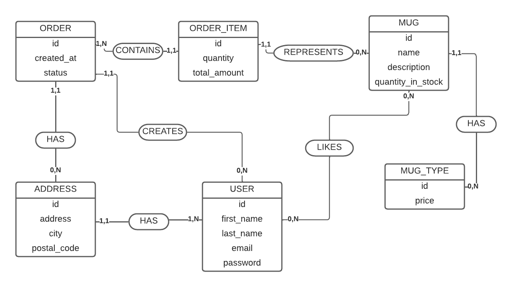

# Livrable 4 - MCD

> Un boulot pas mauvais tout ça, mais des règles de gestions plus claires t'auraient sans doute évité des erreurs ;-)

## Règles de gestions

Je récapitule ce que je comprends ici :

### USER

-   un utilisateur a au moins une adresse de livraison
-   un utilisateur peut avoir plusieurs adresses
-   un utilisateur peut liker des plusieurs produits
-   un utilisateur peut passer des commandes

### PRODUCT

-   un produit peut être liké par plusieurs utilisateurs
-   un produit peut appartenir à plusieurs commandes

### ORDER

-   une commande ne peut appartenir qu'à un seul utilisateur
-   une commande ne contient qu'un seul produit (mais si j'ai bien compris, il y a plusieurs produits dans un produit?) ?

### ADDRESS

-   une adresse appartient à un seul utilisateur

## Correction de ton schema tel qu'il est

**_ADDRESS - USER_** :
Tu as mis 0,N en cardinalité du côté USER : cela veut dire que ton utilisateur pourrait avoir 0 adresse ? Dans ton texte, tu parles d'une ou plusieurs adresses, ce qui me paraît plutôt judicieux en soit. La cardinalité correspondante, c'est donc 1,N

**_USER - PRODUCT_** :
La many-to-many, tu l'as bien vue, mais mal transcrite 😉
Côté USER, un utilisateur peut liker 0 ou plusieurs produits = 0,N
Côté PRODUCT, c'est la même, un produti peut être liké par 0 ou plusieurs USERs = 0,N

**_PRODUCT - ORDER_** :
Si une commande peut contenir plusieurs produits (ce que ton texte ne précise pas - tu dis "un"), alors les cardinalités sont correctes.

**_ORDER - USER_** :
Les cardinalités sont nickel 👌 Je n'adhère pas tout à fait à ton choix d'association (GENERATE). A la limite, CREATE ? ou juste HAS ?

## Remarques sur tes choix

Il y a de l'idée là-dessous, mais j'ai plusieurs questions :

1. Comment sais-tu à quelle adresse de livraison livrer la commande si l'utilisateur peut en avoir plusieurs et que ADDRESS n'a aucun lien avec ORDER ?

-> il faut rajouter des règles de gestion, tu ne crois pas ?

    - une commande doit avoir une seule adresse
    - une adresse peut être utilisée pour plusieurs commandes

2. `amount` est-il vraiment la responsabilité de PRODUCT ? Sauf si c'est le stock dont tu parles ? Mais si c'est le nombre de ce produit de ce type dans la commande, c'est la responsabilité de ORDER.
   -> à mon sens, il manque une entité à ton schéma : ORDER_ITEM
   C'est à elle que tu pourras donner un `amount`, et tu lui associeras un produit. Et c'est elle qui sera liée à ORDER.

3. Si `amount` était bien le stock cela dit, tu peux effectivement changer le nom en `stock`. On a besoin de savoir s'il reste des produits avant de permettre à un utilisateur d'en ajouter dans sa commande.

4. concernant le `mug_type`, je suis confuse 😅 C'est la taille du mug ? Sa forme ? J'imagine que ça joue sur son prix ? D'ailleurs...tes produits son gratuits ? Moi ça me va!! Mais comme tu parles d'achats...

Du coup, on va trouver une solution ensemble :

-   si mug_type, c'est la taille ou la forme de ton mug, et que le prix en dépend, je propose d'ajouter une entité MUG_TYPE, et de lui donner un prix ?
-   sinon, ajoute juste un prix dans ton PRODUCT ?

Ce qui donne :

    *** avec MUG_TYPE ***
    Un type de mug peut appartenir à plusieurs produits
    Un produit n'a qu'un type de mug

Ensuite, si on chipote un peu plus pour les propriétés des entités :

-   user ne devrait-il pas avoir au moins un nom et un prénom pour pouvoir lui livrer sa commande en toute paix et sérénité 😉

-   Ne manquerait-il pas des dates dans ORDER ? Le statut c'est pas mal, mais au moins une date de création c'est intéressant, non?

Pssst : en vrai, dans la pratique, quand on fait un ecommerce, on a au moins 4 entités pour gérer les commandes :

-   ORDER (bien vu donc!)
-   ORDER_ITEM
-   CART
-   CART_ITEM

L'architecture des ecommerce et marketplace est assez complexe parce qu'il est important de garder une trace de TOUT, de pouvoir revenir en arrière sur les paiements et justifier toute incompréhension ou erreur. Les gens, dès qu'il s'agit d'argent 🙄 Non mais plus sérieusement c'est aussi pour des questions juridiques et purement logistiques.

Nous on va juste se contenter d'ajouter :

-   un MUG_TYPE avec un prix auquel peut être lié 0 ou plusieurs produits
-   un ORDER_ITEM avec une quantité et lié à un produit
-   changer amount en quantity_in_stock (si amount était le prix, et qu'il n'a rien à voir avec mug_type, my bad 😅 )
-   ajouter la relation entre l'adresse et la commande (ce serait bête que le client ne reçoive rien!)

Et ça me paraît un bon début ? Ce qui nous donne ce schéma :

Bon, j'ai changé product en MUG aussi?
Il y a un `total_amount` sur order_item car, si le prix d'un produit change, le prix d'un produit commandé et payé de bougera pas ET c'est plus facile de gérer le calcul du prix total d'une commande si on a le prix total d'une certaine quantité d'articles directement, plutôt que d'un seul article, mais bon c'est un choix discutable.
